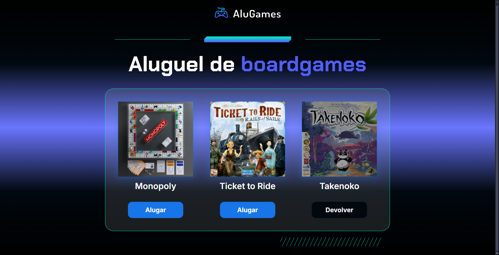

# Sorteador de Números

Um projeto web interativo para aluguel de boardgames, com interface moderna e responsiva.

## Menu

- [Layout](#layout)
- [Descrição](#descrição)
  - [Principais recursos incluem](#principais-recursos-incluem)
  - [Próximos passos de desenvolvimento](#próximos-passos-de-desenvolvimento)
- [Tecnologias Utilizadas](#tecnologias-utilizadas)
- [Estrutura de Pastas](#estrutura-de-pastas)
  - [Arquivos Principais](#arquivos-principais)
- [Como Instalar e Rodar o Projeto](#como-instalar-e-rodar-o-projeto)
  - [Configuração](#configuração)
  - [Casos de Uso Comuns](#casos-de-uso-comuns)
  - [Solução de Problemas](#solução-de-problemas)
- [Projeto ao Vivo](#projeto-ao-vivo)
- [Licença](#licença)
- [Autor](#autor)

---

## Layout



- **Design**:
  - Gradiente com tons escuros e azul.
  - Botões interativos para alugar e devolver jogos.
  - Responsivo para diferentes tamanhos de tela.

---

## Descrição

### Principais recursos incluem

- **Aluguel e devolução de jogos**: Alterne entre os estados de "Alugar" e "Devolver" com um clique.
- **Interface dinâmica**: Atualização visual dos itens alugados.
- **Responsividade**: Adapta-se a diferentes dispositivos.

### Próximos passos de desenvolvimento

- [ ] Adicionar mais jogos ao catálogo.
- [ ] Implementar um sistema de autenticação para usuários.
- [ ] Adicionar histórico de aluguéis.

---

## Tecnologias Utilizadas

- **Front-end**:  
    
- **Fontes**: Google Fonts (Chakra Petch, Inter).

---

## Estrutura de Pastas

```plaintext
sorteador/
├── css/                        # Estilos
│   ├── _reset.css              # Reset de estilos
│   └── main.css                # Estilos principais
├── img/                        # Imagens
│   ├── logo.svg                # Logo do projeto
│   ├── fade_bar.svg            # Barra visual
│   ├── monopoly.png            # Imagem do jogo Monopoly
│   ├── ticket_to_ride.png      # Imagem do jogo Ticket to Ride
│   ├── takenoko.png            # Imagem do jogo Takenoko
│   └── hachuras.svg            # Elemento visual
├── index.html                  # Página principal
├── js/                         # Scripts
│   └── app.js                  # Lógica de interação
├── screenshot/                 # Screenshot
│   └── tela-principal.png      # Imagem da tela principal do projeto
├── LICENSE                     # Licença do projeto
└── README.md                   # Documentação do projeto
```

### Arquivos Principais

- `index.html`: Estrutura da página com os jogos e botões de interação.
- `app.js`: Função alterarStatus() para gerenciar o estado dos jogos.
- `main.css`: Estilos principais, incluindo gradientes e responsividade.

---

## Como Instalar e Rodar o Projeto

### Configuração

1. Clone o repositório:

```bash
git clone https://github.com/Melksedeque/alugames.git
```

2. Abra o arquivo index.html no navegador.

### Casos de Uso Comuns

1. Clique em "Alugar" para marcar um jogo como alugado.
2. Clique em "Devolver" para marcar um jogo como disponível.

### Solução de Problemas

- **Botão não funciona:** Verifique se o arquivo app.js está corretamente referenciado no index.html.
- **Estilos quebrados:** Certifique-se de que os arquivos CSS estão no caminho correto.

---

## Projeto ao Vivo

Você pode ver o projeto ao vivo neste link: [https://melksedeque.github.io/alugames/](https://melksedeque.github.io/alugames/)

---

## Licença

Este projeto está licenciado sob a Licença MIT. Veja o arquivo [LICENSE](https://github.com/Melksedeque/alugames?tab=MIT-1-ov-file) para mais detalhes.

---

## Autor

- GitHub - [Melksedeque Silva](https://github.com/Melksedeque/)
- FrontEndMentor - [@Melksedeque](https://www.frontendmentor.io/profile/Melksedeque)
- Twitter / X - [@SouzaMelk](https://x.com/SouzaMelk)
- LinkedIn - [Melksedeque Silva](https://www.linkedin.com/in/melksedeque-silva/)
